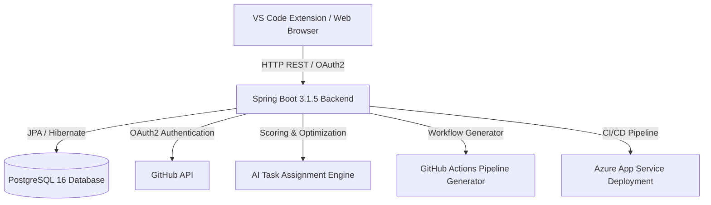

# Project Brief: Galactico – GitHub-Integrated Project Management & CI/CD Platform

---

## Executive Summary

**Galactico** is a full-stack, developer-centric project management platform designed to unify software development workflows, version control, AI intelligence, and IDE environments into a seamless system.

Traditional project management tools (e.g., Jira, Trello) are decoupled from the code editor and version control system. Developers are forced to constantly switch context, manually track tasks, update ticket statuses, and format commit messages. Galactico eliminates this friction by:
- **Parsing Git commit messages** automatically to transition task statuses on Kanban boards in real time.
- Providing a **native VS Code extension** so developers can manage sprints, tasks, and Git workflows without leaving their IDE.
- Utilizing an **AI-powered Task Assignment Engine** that evaluates team member workloads, expertise, historical velocity, and capacity to recommend or automatically assign tasks with full decision auditability.
- Automatically generating **multi-language CI/CD pipelines** for GitHub Actions.
- Providing an **end-to-end DevOps setup** with Docker Compose containerization, SonarCloud analysis, and automated deployment to Azure App Service.

---

## Key Problems Solved

| Problem | Traditional Workflow | Galactico Solution |
|---|---|---|
| **Context Switching** | Developers frequently jump between IDE, web browsers, Jira, and GitHub. | Native **VS Code Extension** lets developers view tasks, commit code, and manage sprints inside the editor. |
| **Manual Task Updates** | Tickets become outdated when developers forget to update statuses manually. | **Git Commit Parsing** updates task statuses automatically from commit keywords (e.g., `Feature01 : fix bug -> user -> done`). |
| **Suboptimal Task Allocation** | Tasks are assigned manually based on intuition, causing workload imbalances. | **AI Task Assignment Engine** uses a 4-factor scoring algorithm (Velocity, Capacity, Expertise, History) for smart assignments. |
| **Complex CI/CD Setup** | Setting up GitHub Actions workflows for multi-language projects takes significant manual effort. | Built-in **CI/CD Generator** creates tailored pipeline YAML configs for Java, Node.js, Python, Go, and Docker. |
| **Deployment Complexity** | Environment mismatches between local and staging environments. | **Docker Compose** containerization and automated **Azure App Service CI/CD deployment**. |

---

## Core System Architecture

Galactico follows a modern layered architecture with a Spring Boot backend, a PostgreSQL relational database, Thymeleaf & Vanilla JS frontend, a TypeScript VS Code extension, and cloud deployment hooks.



---

## Detailed Feature Highlights

### 1. Git Commit Parser & Automated Status Tracking
Galactico listens to Git commit activity and parses commit messages to automatically transition tasks through board columns (**TODO**, **IN-PROGRESS**, **DONE**).

- **Format Convention**:
  ```text
  FeatureCode : description -> GitHubUsername -> status
  ```
- **Example**:
  ```text
  Feature01 : Implement authentication endpoint -> john_doe -> in-progress
  Feature01 : Authentication unit tests passing -> john_doe -> done
  ```

### 2. AI-Powered Intelligent Task Assignment Engine
The AI task assignment engine calculates a weighted suitability score for team members to determine optimal task allocation.

#### Scoring Formula Breakdown:
1. **Performance & Velocity (40% weight)**:
   - Productivity score based on commit frequency and lines of code changed.
   - Code quality score (PR approval rate, review feedback).
   - On-time sprint delivery history.
2. **Availability & Capacity (30% weight)**:
   - Current active task load and story points.
   - Capacity utilization index (inversely proportional to current overload).
3. **Expertise Matching (20% weight)**:
   - Keyword and file-type analysis extracted from past commits matching task tags (Frontend, Backend, DevOps, Database, Testing).
4. **Historical Adherence & Penalties/Bonuses (10% weight)**:
   - Adjustments based on historical deadline compliance.

#### Decision Auditability:
Every decision is saved in the `AIAssignmentDecision` entity log, storing candidate rankings, scores, and explicit reasoning to ensure transparency.

### 3. Native VS Code Extension (`Extension/`)
Built with TypeScript and the VS Code Extension API, the extension empowers developers with:
- **Authentication**: Connects seamlessly with the Galactico server via token-based auth.
- **Task Management Dashboard**: Embedded webview displaying assigned tasks, sprint backlogs, and status badges inside VS Code.
- **1-Click Git Operations**: "Git Auto" command adds modified files, formats commit messages with task IDs, and pushes to remote repositories in a single action.
- **CI/CD Generator**: Interactively prompts developers to select project runtime and builds `.github/workflows/` YAML files directly into the repository.

### 4. Multi-Language CI/CD Pipeline Generator
Allows developers to instantly auto-generate GitHub Actions CI/CD workflows tailored to project tech stacks:
- **Java / Spring Boot**: Maven build, test execution, SonarCloud scanning, JAR packaging.
- **Node.js**: Dependency installation, linting, testing, artifact bundling.
- **Python**: Pytest suite, dependency management, flake8 linting.
- **Go**: Unit testing, formatting checks, binary compilation.
- **Docker**: Image building, tag management, and registry push (GHCR / Azure CR).

### 5. Agile Scrum & Team Analytics Suite
- **Kanban Board**: Drag-and-drop task card interface with real-time column updates.
- **Sprint Management**: Create, start, complete, and track active sprint cycles.
- **Product Backlog**: Prioritized story point estimation, issue types (Bug, Feature, Chore), and acceptance criteria.
- **Audit Timeline**: Comprehensive audit log recording all sprint and task updates.
- **Developer Analytics**: Contributor velocity graphs, commit frequency charts, and repository language breakdowns.

---

## Technology Stack

| Layer | Technology Used | Description / Purpose |
|---|---|---|
| **Backend Framework** | **Spring Boot 3.1.5** | Core server layer, REST APIs, business logic orchestration |
| **Language** | **Java 17** | Strongly typed, modern long-term support (LTS) backend |
| **Security & Auth** | **Spring Security, JWT, GitHub OAuth2** | GitHub OAuth2 authentication & stateless JWT token session control |
| **Database** | **PostgreSQL 16** | Relational database (Production) |
| **Test Database** | **H2 Database** | In-memory database for fast, isolated unit & integration testing |
| **Template Engine** | **Thymeleaf** | Server-side rendering for administrative and web UI views |
| **Frontend Styling** | **Vanilla JS, Custom Dark Design System CSS3** | Custom responsive dark UI system with zero heavy CSS framework bloat |
| **IDE Extension** | **TypeScript, VS Code API** | VS Code Extension for IDE-level developer workflows |
| **Build & Tooling** | **Apache Maven 3.9.4** | Dependency management and build automation |
| **Containerization** | **Docker & Docker Compose** | Multi-container application orchestrator (`autotrack-app` + `galactico-postgres`) |
| **Code Quality** | **SonarCloud / OWASP Dependency Check** | Static code security scanning and vulnerability suppression tracking |
| **Cloud Deployment** | **Azure App Service (Korea Central)** | Cloud hosting with automated deployment via GitHub Actions |

---

## Database & Data Models

Core entities in the system schema include:
- `User`: Team member profiles, GitHub IDs, roles (Lead, Member), avatar URLs.
- `Project`: Project metadata, repository URLs, team access controls.
- `Task`: Task codes, titles, descriptions, status (`TODO`, `IN_PROGRESS`, `DONE`), story points, assigned user.
- `Sprint`: Sprint title, dates, status (`PLANNED`, `ACTIVE`, `COMPLETED`), goal descriptions.
- `ContributionScore`: Developer metrics snapshot storing productivity, velocity, and skill tags.
- `AIAssignmentDecision`: Transparent audit records storing AI candidate evaluation metrics.
- `ActivityLog`: Historical timeline entries tracking task state changes and team interactions.

---

## DevOps & Cloud Deployment Architecture

```text
Local Machine / IDE 
    │
    ├──> Git Push to GitHub
    │
    └──> GitHub Actions Workflow (.github/workflows/azure-deploy.yml)
            ├── 1. Run Maven Tests (H2 DB)
            ├── 2. Perform SonarCloud Code Analysis
            ├── 3. Build Production Docker Image
            ├── 4. Push Image to GitHub Container Registry (GHCR) / Azure CR
            └── 5. Deploy Image to Azure App Service (Korea Central)
```

### Environment Configuration Requirements:
- `GITHUB_CLIENT_ID` & `GITHUB_CLIENT_SECRET`: OAuth application credentials.
- `JWT_SECRET`: Minimum 32-character signing secret.
- `ENCRYPTION_KEY`: 32-character AES encryption key.
- `DB_NAME`, `DB_USERNAME`, `DB_PASSWORD`: PostgreSQL database access parameters.

---

## Running the Application Locally

### Quick Start with Docker Compose

1. **Clone & Configure Environment**:
   ```bash
   cp .env.example .env
   # Edit .env with your GitHub OAuth Client ID & Secret
   ```

2. **Launch Containers**:
   ```bash
   docker-compose up --build -d
   ```

3. **Access Application**:
   - Web App: `http://localhost:5000` (or configured public tunnel URL)
   - Database: PostgreSQL on port `5433` (mapped from `5432`)

### Running Backend from Source

```bash
# Build package skipping tests
mvn clean package -DskipTests

# Run local Spring Boot application
java -jar target/autotrack-*.jar
```

### Building the VS Code Extension

```bash
cd Extension
npm install
npm run compile
# Launch Extension Development Host via F5 in VS Code
```

---

## Summary & Future Roadmap

**Galactico** successfully solves developer friction by bridging code, version control, project management, and cloud automation.

### Future Roadmap Enhancements:
- **WebSocket Real-time Updates**: Live board updates when team members or Git commits change task statuses.
- **Predictive Velocity Forecasting**: AI-driven sprint completion prediction using historical team throughput.
- **Multi-Repository Task Syncing**: Cross-repository task dependencies and unified team backlogs.
